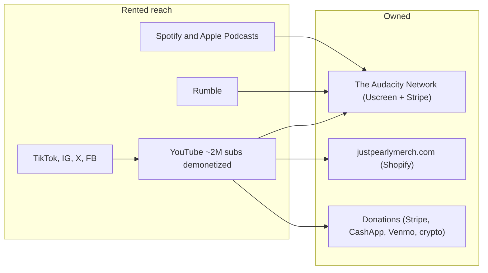

# 01 — Current Footprint Audit

An inventory of every channel, property, and revenue stream in the JustPearlyThings / The Audacity Network ecosystem as of July 2026, based on public information. This is the baseline everything else in this research builds on.

## The business entity

- **JustPearlyThings, LLC** (Vero Beach, FL) — the legal entity behind both the JustPearlyThings brand and The Audacity Network. It is the developer of record for the mobile apps and the counterparty in The Audacity Network's Terms of Service.

## Owned properties

| Property | Status | Platform / tech | Role today |
|---|---|---|---|
| `theaudacitynetwork.com` | Live (behind Cloudflare) | Custom landing page; membership storefront at `watch.theaudacitynetwork.com` runs on **Uscreen** (a rented video-membership SaaS) | The main owned platform: subscription video, live streams, community features. $9.99/mo or $99.99/yr |
| `justpearlymerch.com` | Live | **Shopify** (resolves to Shopify infrastructure) | Current official merch store |
| `theaudacitynetwork.store` | **Dead — no DNS** | Was the previous merch store | Still linked in many older video/podcast descriptions; those links are broken |
| `audacitymerch.com` | **Dead — no DNS** | Was an earlier merch link | Still linked in Spotify podcast descriptions; broken |
| `justpearlythings.com` | **No DNS records** | — | The brand-name domain serves nothing; confirmed taken by a third party (July 2026) but unused |
| iOS app "The Audacity Network" | Live | Uscreen white-label app (`tv.uscreen.theaudacitynetwork`), in-app subscriptions via Apple | Mobile access to the membership |
| Android app | Live (updated Oct 2025) | Same Uscreen white-label app, Google Play billing | Mobile access to the membership |

Notes:

- `theaudacitynetwork.com` also hosts an [About Pearl Davis page](https://www.theaudacitynetwork.com/about) — currently the only owned bio/press surface for her name.
- `theaudacitynetwork.com/email` is linked in current video descriptions as "Join Our Emailing List," but fetching it returns the same generic landing-page content as the homepage (donation and subscribe CTAs) with no visible signup form. Whether a working email-capture form exists there needs to be verified in a real browser — see open questions in [05-roadmap.md](05-roadmap.md).

### Name-brand domain landscape (checked July 2026)

There is no website under her own name or the JustPearlyThings brand:

| Domain | Status |
|---|---|
| `justpearlythings.com` | **Registered by a third party** (confirmed July 2026) but serving no DNS records — unused |
| `justpearlythings.net` / `.org` | Resolve to domain-parking infrastructure, no real site |
| `pearldavis.com` | Parked and listed for sale at $3,488 (Spaceship) — held by a reseller |
| `hannahpearldavis.com` | **Registered July 2026 (Namecheap)** as a defensive registration; currently on default parking records |

Searches for "JustPearlyThings" or "Pearl Davis" therefore land exclusively on third-party properties (YouTube, Wikipedia, critics).

## Rented (third-party) channels

| Channel | Status | Role |
|---|---|---|
| YouTube — `@JustPearlyThings` | ~2.06M subscribers, ~292M views. **Demonetized since 2024** | Top-of-funnel: clips and some full episodes drive traffic to The Audacity Network. No ad revenue |
| YouTube — `@JustPearlyClips`, `@JustpearlythingsBTS` | Live | Secondary clip/BTS channels |
| Rumble — `rumble.com/c/JustPearlyThings` | Live | Alternative video host; full episodes and reacts |
| Spotify — "JustPearlyThings" & "Pearl Daily" podcasts | Live | Audio distribution (also on Apple Podcasts) |
| TikTok | Current account live; original ~900k-follower account **banned in 2022** | Short-form reach |
| Instagram — `justpearlythingsofficial` | Live | Short-form reach |
| X/Twitter — `@pearlythingz` | Live | Commentary and reach |
| Facebook | Live | Reach |

## Revenue streams

1. **Memberships** — The Audacity Network subscriptions ($9.99/mo, $99.99/yr, with a $79.99 annual upsell), processed through **Stripe** on web and through Apple/Google billing in the apps.
2. **Merch** — Shopify store at `justpearlymerch.com`.
3. **Donations** — direct on `theaudacitynetwork.com` (Stripe), plus Cash App (`$pearlythings`), Venmo (`Just_pearlythings`), and BTC/BCH/ETH addresses pasted into video descriptions.
4. **Crowdfunding** — an active GoFundMe for a "divorce documentary" project.
5. **YouTube ads** — none since the 2024 demonetization.

## How the funnel works today

Everything flows through description links. There is no single hub page, no confirmed working email capture, and the calls to action in older content point at domains that no longer exist.

## Immediate observations

- **The funnel leaks.** Two of the merch domains linked across hundreds of episode descriptions are dead. Anyone clicking those links buys nothing.
- **The brand domain is out of reach for now.** `justpearlythings.com` is held by a third party and serves nothing — the brand name with ~2M subscribers' worth of recognition has no home page. The owned hub will launch on `hannahpearldavis.com` instead.
- **Email capture is a Google Form (old descriptions) or a page with no visible form (new descriptions).** There is no evidence of a functioning owned email list, which is the single most portable audience asset a creator can have.
- **The owned platform is rented.** The Audacity Network runs on Uscreen — a solid product, but a SaaS vendor that can terminate service, and the mobile apps depend on Apple/Google review. See [02-risks-and-gaps.md](02-risks-and-gaps.md).

## Sources

- Wikipedia: [Hannah Pearl Davis](https://en.wikipedia.org/wiki/Hannah_Pearl_Davis) (subscriber counts, demonetization, TikTok ban)
- [The Audacity Network](https://theaudacitynetwork.com) homepage and [Terms of Service](https://www.theaudacitynetwork.com/terms) (LLC, Stripe, membership terms)
- Google Play / Apple App Store listings for The Audacity Network (Uscreen package id, developer identity)
- Rumble and podcast episode descriptions (current link set: memberships, email list URL, `justpearlymerch.com`, GoFundMe)
- Spotify podcast description (Cash App/Venmo/crypto addresses, older merch links)
- DNS lookups performed July 2026 (`justpearlythings.com`, `audacitymerch.com`, `theaudacitynetwork.store` — no A records; `justpearlymerch.com` — Shopify IP; `theaudacitynetwork.com` — Cloudflare)
- [J4MB post, Sept 2025](https://j4mb.org.uk/2025/09/11/pearl-davis/) (subscription pricing, YouTube-as-funnel strategy)
